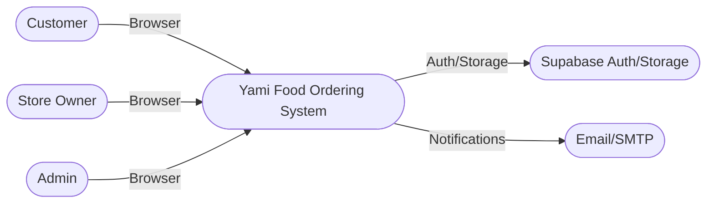
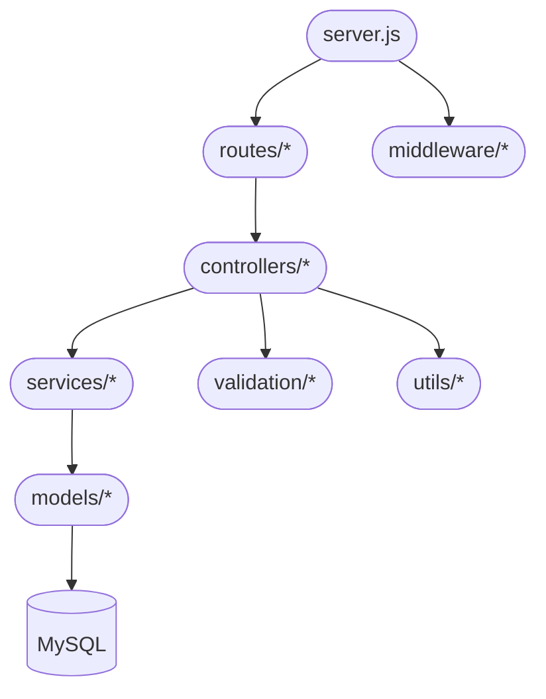

# C4 Model – Yami Project

Tài liệu này mô tả mô hình C4 cho dự án Yami với kiến trúc microservice và API Gateway (Nginx).

## Cấp 1 – System Context



**Mục tiêu:** Người dùng truy cập một hệ thống đặt đồ ăn; hệ thống tích hợp Supabase và dịch vụ email.

---

## Cấp 2 – Container

```mermaid
flowchart LR
  subgraph Clients
    public_ui([Public Client (Vite)])
    store_ui([Store Client (Vite)])
    admin_ui([Admin Client (Vite)])
  end

  gateway_pub([API Gateway - Public (Nginx :80)])
  gateway_admin([API Gateway - Admin (Nginx :8081)])
  gateway_store([API Gateway - Store (Nginx :8082)])

  backend([Backend Monolith (Node.js :3000)])
  public_svc([Public Service (Node.js :3000)])
  store_svc([Store Service (Node.js :3000)])
  customer_svc([Customer Service (Node.js :3000)])
  admin_svc([Admin Service (Node.js :3000)])
  images_svc([Images Service (Node.js :3000)])

  db[(MySQL :3306)]
  redis[(Redis :6379)]
  supabase([Supabase Auth/Storage])
  email([Email/SMTP])

  public_ui --> gateway_pub
  admin_ui --> gateway_admin
  store_ui --> gateway_store

  gateway_pub -->|/api/*| public_svc
  gateway_pub -->|/api/store/*| store_svc
  gateway_pub -->|/api/customer/*| customer_svc
  gateway_pub -->|/api/admin/*| admin_svc
  gateway_pub -->|/api/images/*| images_svc

  gateway_admin -->|/api/*| public_svc
  gateway_admin -->|/api/admin/*| admin_svc
  gateway_admin -->|/api/store/*| store_svc
  gateway_admin -->|/api/customer/*| customer_svc
  gateway_admin -->|/api/images/*| images_svc

  gateway_store -->|/api/*| public_svc
  gateway_store -->|/api/store/*| store_svc
  gateway_store -->|/api/customer/*| customer_svc
  gateway_store -->|/api/admin/*| admin_svc
  gateway_store -->|/api/images/*| images_svc

  public_svc --> db
  store_svc --> db
  customer_svc --> db
  admin_svc --> db
  images_svc --> db

  public_svc --> redis
  store_svc --> redis
  customer_svc --> redis
  admin_svc --> redis

  public_svc --> supabase
  store_svc --> supabase
  images_svc --> supabase

  public_svc --> email
  store_svc --> email
  customer_svc --> email
  admin_svc --> email

  backend -. legacy / fallback .-> db
```

**Ghi chú:** Gateway route theo prefix `/api`. UI gọi gateway tương ứng.

---

## Cấp 3 – Component (Backend Monolith)



**Mô tả:** Monolith gồm `server.js`, `routes`, `controllers`, `services`, `models` và các lớp `middleware/validation/utils`.

---

## Mapping nhanh (Gateway)

- Public Gateway: http://localhost
- Admin Gateway: http://localhost:8081
- Store Gateway: http://localhost:8082

API đi qua gateway với prefix `/api`.
